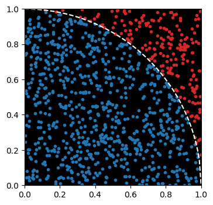
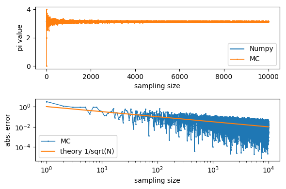

### [1st - December 2, 2019] Persatuan Ular Python Indonesia Tokodai
# Pi estimator using Monte Carlo method 

1. Generate $N$ random datapoints $(x,y)\in[0,1]\times[0,1]$.
2. For any datapoints inside the circle are counted as hit.
3. Calculate pi.
$$
\frac{\text{(# of hits)}}{N} \to \frac{\text{circle area}}{\text{square area}}=\frac{\pi}{4} \quad \left( N \to \infty\right)   
$$
4. Analyze the error.

#### Skill to be aquired :
* Array manipulation using Numpy
* Generating random number using Numpy
* Plotting using matplotlib/pyplot
* Monte Carlo method
* Logical thingking and algorithm development
